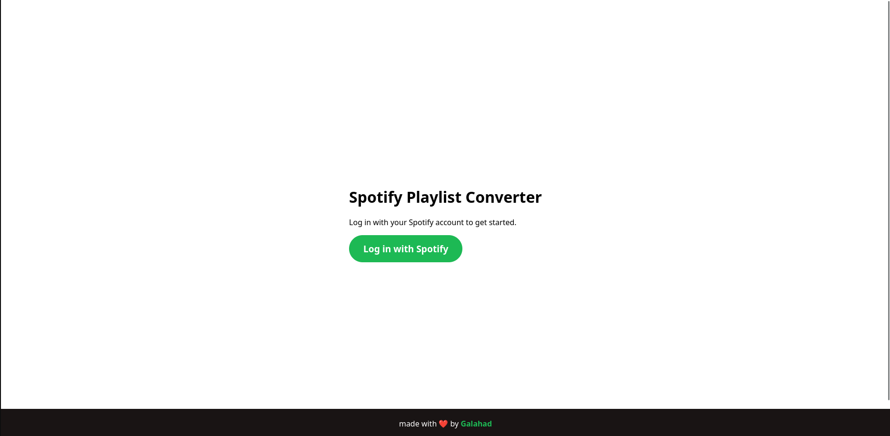
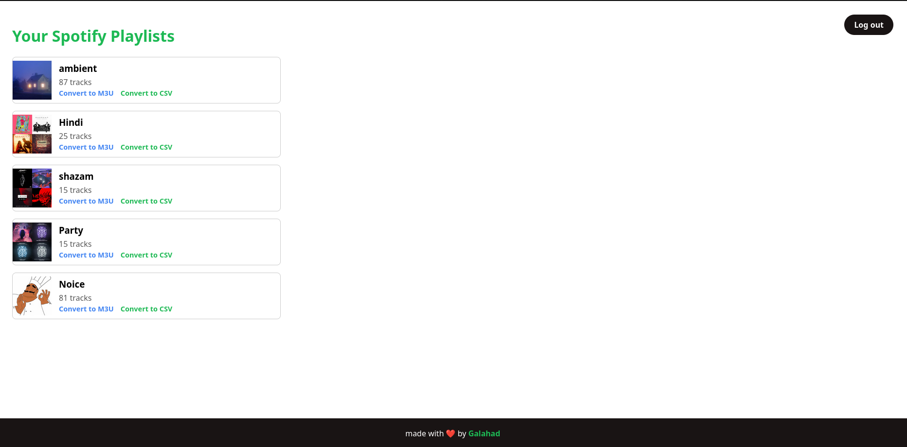

Spotify to YouTube Music Playlist Converter

Tired of your playlists being locked into one platform? This web app lets you securely log in to your Spotify account, view all your playlists, and convert any of them into universal .m3u or .csv files.

It works by matching your Spotify tracks with songs on YouTube Music, giving you a portable playlist file you can use in any media player (like VLC) or back up as a spreadsheet.

📸 App Preview

A user first logs in via the official Spotify login page. After authenticating, they are shown their full list of playlists. From there, they can choose to convert any playlist to M3U or CSV.

| Login Page | Playlist View | 
| :---: | :---: | 
|  |  |

To add your own image: Take a screenshot of index.html, upload it to your repo, and update this link.

To add your own image: Take a screenshot of playlists.html, upload it, and update this link.

✨ Features

Secure Spotify Login: Uses the official Spotify OAuth 2.0 flow. Your credentials are never seen by the app.

Full Playlist Access: Fetches and displays all your public and private Spotify playlists.

Dual-Format Export:

.m3u: A universal playlist format perfect for media players like VLC, PotPlayer, etc.

.csv: A spreadsheet-friendly format for backup and analysis.

Fast & Quota-Free Matching: Uses ytmusicapi to search YouTube Music directly, avoiding the strict API quotas of the official YouTube Data API.

Clean, Simple UI: A minimal frontend with a "loading" state so you know it's working.

🛠️ Tech Stack

🐍 Backend: Flask

🎵 APIs: Spotipy (Spotify) & ytmusicapi (YouTube Music)

📄 Frontend: HTML & CSS with Jinja2 for templating.

🚀 Setup & Installation

To run this project locally, you'll need to set up your own Spotify Developer app.

1. Clone the Repository

git clone [https://github.com/Galahad-070/your-repo-name.git](https://github.com/Galahad-070/your-repo-name.git)
cd your-repo-name

2. Set Up a Virtual Environment (Recommended)

On macOS/Linux:

python3 -m venv venv
source venv/bin/activate

On Windows:

python -m venv venv
.\venv\Scripts\activate

3. Install Dependencies

pip install -r requirements.txt

⚙️ Configuration (The Most Important Step)

This app will not run without valid Spotify API keys and a correct Redirect URI.

A. Spotify Developer Dashboard

Go to the Spotify Developer Dashboard.

Log in and click "Create app".

Give it any name (e.g., "My Flask Converter") and description.

Once created, you will see your Client ID and Client Secret.

Now, click "Edit Settings".

Find the Redirect URIs section. This is crucial.

Add this exact URI for local testing: http://127.0.0.1:5000/callback

Click "Add" and then "Save".

B. Set Your Environment Variables

You must set three environment variables in your terminal before running the app.

On macOS/Linux:

# A random, long string for session security
export FLASK_SECRET_KEY='make_up_a_very_long_random_string_here'

# Your keys from the Spotify dashboard
export SPOTIPY_CLIENT_ID='your-spotify-client-id-goes-here'
export SPOTIPY_CLIENT_SECRET='your-spotify-client-secret-goes-here'

On Windows (Command Prompt):

# A random, long string for session security
set FLASK_SECRET_KEY="make_up_a_very_long_random_string_here"

# Your keys from the Spotify dashboard
set SPOTIPY_CLIENT_ID="your-spotify-client-id-goes-here"
set SPOTIPY_CLIENT_SECRET="your-spotify-client-secret-goes-here"

▶️ How to Run

With your environment variables set and dependencies installed, simply run:

python app.py

Your app will be live! Open your browser and go to http://127.0.0.1:5000.

📂 Project Structure

spotify-converter/
├── app.py              # The main Flask server (all logic)
├── requirements.txt      # Python dependencies
└── templates/
    ├── index.html      # The "Log in" homepage
    └── playlists.html  # The page that lists user playlists

⚠️ Known Limitation: Synchronous Conversions

This app is a simple prototype and handles conversions synchronously.

This means that when you click "Convert," the server "blocks" (freezes) until the entire playlist is fetched and all songs are matched. For a short playlist (50 songs), this is fine. For a long playlist (500+ songs), the server will be unresponsive for several minutes.

The next step for this project would be to implement a task queue (like Celery with Redis) to handle these long-running jobs in the background, making the UI feel instant.

<footer>

made with ❤️ by <a href="https://github.com/Galahad-070" target="_blank" rel="noopener noreferrer">Galahad</a>

</footer>
